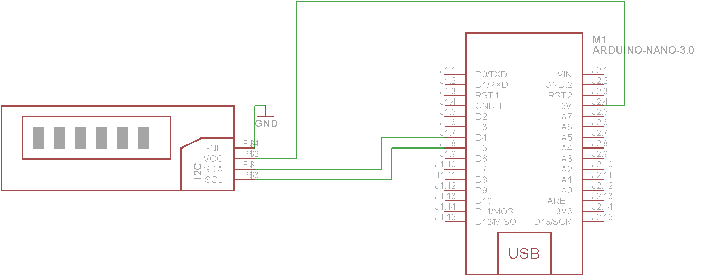

## 16x2 LCD display with I2C module

LCD (Liquid Crystal Display) screen is an electronic display module and find a wide range of applications. A 16x2 LCD display is very basic module and is very commonly used in various devices and circuits. These modules are preferred over seven segments and other multi segment LEDs. The reasons being: LCDs are economical; easily programmable; have no limitation of displaying special & even custom characters (unlike in seven segments), animations and so on.

#### Features:

A 16x2 LCD means it can display 16 characters per line and there are 2 such lines. In this LCD each character is displayed in 5x7 pixel matrix. This LCD has two registers, namely, Command and Data.

The command register stores the command instructions given to the LCD. A command is an instruction given to LCD to do a predefined task like initializing it, clearing its screen, setting the cursor position, controlling display etc. The data register stores the data to be displayed on the LCD. The data is the ASCII value of the character to be displayed on the LCD. Click to learn more about internal structure of a LCD.

#### Pinout


#### I2C Module

To use this type LCD directly with Raspberry Pi, you would need 6 pins: RS, EN, D7, D6, D5, and D4 to talk to the LCD. If you are doing more than a simple project, you may be out of pins using a normal LCD shield. With this I2C interface LCD module, you only need 2 lines (I2C) to display information. If you already have I2C devices in your project, this LCD module actually uses no more pins at all.

This unit connects with 4 wires including Vcc and Gnd.


### Raspberry PI usage:

#### Pinout


#### Wiring


#### Important!
* Connect the Logic level shifter between the Raspberry pi and I2C module (wiring figure) !

### Arduino nano usage:

#### Pinout


#### Wiring



#### Example code
```
/* YourDuino.com Example Software Sketch
 16 character 2 line I2C Display
 Backpack Interface labelled "YwRobot Arduino LCM1602 IIC V1"
 terry@yourduino.com */

/*-----( Import needed libraries )-----*/
#include <Wire.h>  // Comes with Arduino IDE
// Get the LCD I2C Library here:
// https://bitbucket.org/fmalpartida/new-liquidcrystal/downloads
// Move any other LCD libraries to another folder or delete them
// See Library "Docs" folder for possible commands etc.
#include <LiquidCrystal_I2C.h>

/*-----( Declare Constants )-----*/
/*-----( Declare objects )-----*/
// set the LCD address to 0x27 for a 20 chars 4 line display
// Set the pins on the I2C chip used for LCD connections:
//                    addr, en,rw,rs,d4,d5,d6,d7,bl,blpol
LiquidCrystal_I2C lcd(0x27, 2, 1, 0, 4, 5, 6, 7, 3, POSITIVE);  // Set the LCD I2C address

/*-----( Declare Variables )-----*/
//NONE

void setup()   /*----( SETUP: RUNS ONCE )----*/
{
  Serial.begin(9600);  // Used to type in characters

  lcd.begin(16,2);   // initialize the lcd for 16 chars 2 lines, turn on backlight

// ------- Quick 3 blinks of backlight  -------------
  for(int i = 0; i< 3; i++)
  {
    lcd.backlight();
    delay(250);
    lcd.noBacklight();
    delay(250);
  }
  lcd.backlight(); // finish with backlight on  

//-------- Write characters on the display ------------------
// NOTE: Cursor Position: (CHAR, LINE) start at 0  
  lcd.setCursor(0,0); //Start at character 4 on line 0
  lcd.print("Hello, world!");
  delay(1000);
  lcd.setCursor(0,1);
  lcd.print("HI!YourDuino.com");
  delay(8000);  

// Wait and then tell user they can start the Serial Monitor and type in characters to
// Display. (Set Serial Monitor option to "No Line Ending")
  lcd.clear();
  lcd.setCursor(0,0); //Start at character 0 on line 0
  lcd.print("Use Serial Mon");
  lcd.setCursor(0,1);
  lcd.print("Type to display");  


}/*--(end setup )---*/


void loop()   /*----( LOOP: RUNS CONSTANTLY )----*/
{
  {
    // when characters arrive over the serial port...
    if (Serial.available()) {
      // wait a bit for the entire message to arrive
      delay(100);
      // clear the screen
      lcd.clear();
      // read all the available characters
      while (Serial.available() > 0) {
        // display each character to the LCD
        lcd.write(Serial.read());
      }
    }
  }

}/* --(end main loop )-- */


/* ( THE END ) */
```
