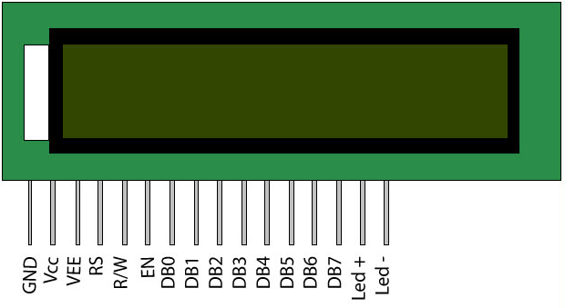

### 16x2 LCD display with I2C module

LCD (Liquid Crystal Display) screen is an electronic display module and find a wide range of applications. A 16x2 LCD display is very basic module and is very commonly used in various devices and circuits. These modules are preferred over seven segments and other multi segment LEDs. The reasons being: LCDs are economical; easily programmable; have no limitation of displaying special & even custom characters (unlike in seven segments), animations and so on.

#### Features:

A 16x2 LCD means it can display 16 characters per line and there are 2 such lines. In this LCD each character is displayed in 5x7 pixel matrix. This LCD has two registers, namely, Command and Data.

The command register stores the command instructions given to the LCD. A command is an instruction given to LCD to do a predefined task like initializing it, clearing its screen, setting the cursor position, controlling display etc. The data register stores the data to be displayed on the LCD. The data is the ASCII value of the character to be displayed on the LCD. Click to learn more about internal structure of a LCD.

#### Pinout

#### I2C Module

To use this type LCD directly with Raspberry Pi, you would need 6 pins: RS, EN, D7, D6, D5, and D4 to talk to the LCD. If you are doing more than a simple project, you may be out of pins using a normal LCD shield. With this I2C interface LCD module, you only need 2 lines (I2C) to display information. If you already have I2C devices in your project, this LCD module actually uses no more pins at all.

This unit connects with 4 wires including Vcc and Gnd.

#### Pinout

#### Wiring

#### Important:
* Connect the Logic level shifter between the Raspberry pi and I2C module (wiring figure) !
