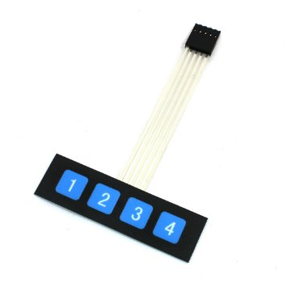
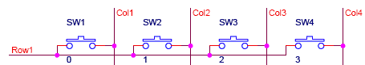
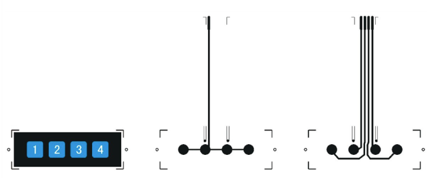
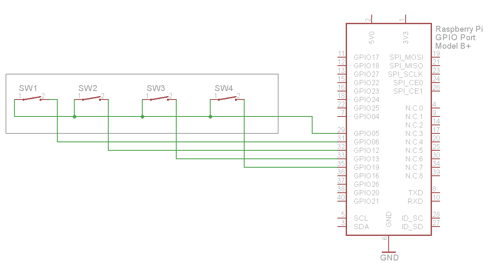

### 4 Key Array Button

Matrix keyboard's structure is similar to the matrix of the keyboard group. When many keys in the keyboard, in order to reduce the occupation of the I/O port, we can use matrix keyboard. Such as the 1 * 4 matrix keyboard has 5 signal lines, then can control 4 buttons.

#### The matrix

#### Scanning the matrix

There are many methods depending on how you connect your keypad with your controller, but the basic logic is same. We make the columns as i/p and we drive the rows making them o/p, this whole procedure of reading the keyboard is called scanning.

In order to detect which key is pressed from the matrix, we make row line low, and read the columns. Lets say we first make Row1 low, then read the columns. If any of the key in row1 is pressed will make the corresponding column as low i.e if second key is pressed in Row1, then column2 will give low. So we come to know that key 2 of Row1 is pressed. This is how scanning is done.

#### Pinout

#### Wiring

