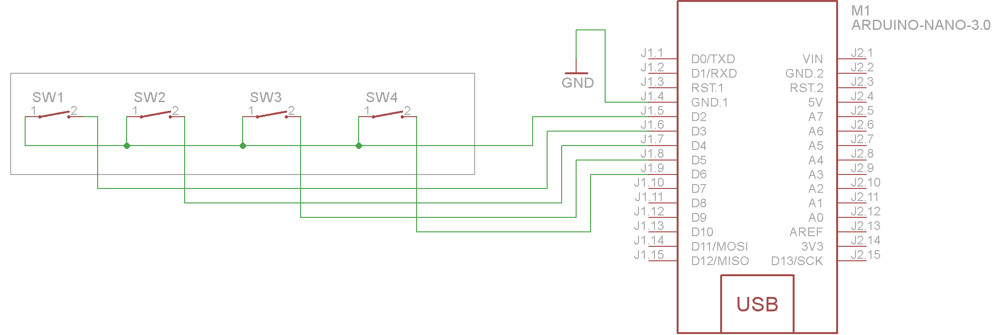

### 4 Key Array Button

Matrix keyboard's structure is similar to the matrix of the keyboard group. When many keys in the keyboard, in order to reduce the occupation of the I/O port, we can use matrix keyboard. Such as the 1 * 4 matrix keyboard has 5 signal lines, then can control 4 buttons.


#### The matrix


#### Scanning the matrix

There are many methods depending on how you connect your keypad with your controller, but the basic logic is same. We make the columns as i/p and we drive the rows making them o/p, this whole procedure of reading the keyboard is called scanning.

In order to detect which key is pressed from the matrix, we make row line low, and read the columns. Lets say we first make Row1 low, then read the columns. If any of the key in row1 is pressed will make the corresponding column as low i.e if second key is pressed in Row1, then column2 will give low. So we come to know that key 2 of Row1 is pressed. This is how scanning is done.

### Raspberry PI usage:

#### Pinout


#### Wiring


### Arduino nano usage:

#### Pinout


#### Wiring



#### First step

Download [Keypad](https://github.com/Chris--A/Keypad) header library, and paste to your /Documents/Arduino/libraries/ lib.

#### Example code
```
#include <Keypad.h>

const byte numRows= 1; //number of rows on the keypad
const byte numCols= 4; //number of columns on the keypad

//keymap defines the key pressed according to the row and columns just as appears on the keypad
char keymap[numRows][numCols]=
{
{'1', '2', '3', '4'},
};

//Code that shows the the keypad connections to the arduino terminals
byte rowPins[numRows] = {2}; //Rows 0 to 1
byte colPins[numCols]= {6,5,4,3}; //Columns 0 to 3

//initializes an instance of the Keypad class
Keypad myKeypad= Keypad(makeKeymap(keymap), rowPins, colPins, numRows, numCols);

void setup()
{
Serial.begin(9600);
}

//If key is pressed, this key is stored in 'keypressed' variable
//If key is not equal to 'NO_KEY', then this key is printed out
//if count=17, then count is reset back to 0 (this means no key is pressed during the whole keypad scan process
void loop()
{
char keypressed = myKeypad.getKey();
if (keypressed != NO_KEY)
{
Serial.print(keypressed);
}
}
```
###### Source:
[Here](http://8051projects.net), [Here](http://adafruit.com)
