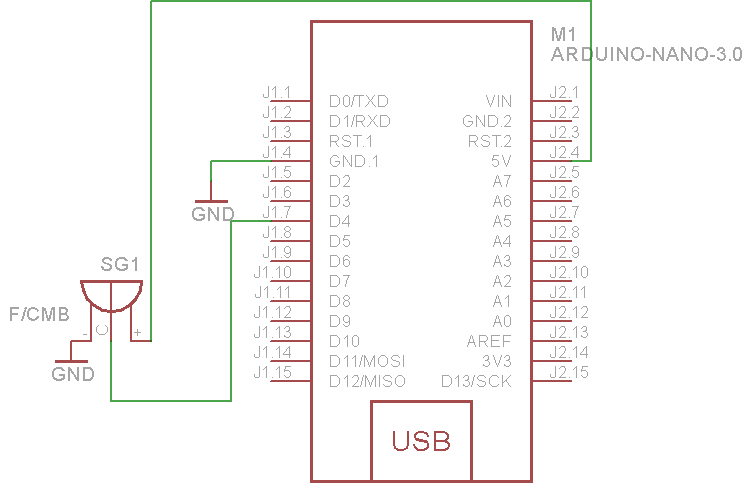

### Passive Buzzer

A buzzer or beeper is an audio signaling device, which may be mechanical, electromechanical, or **piezoelectric**. Typical uses of buzzers and beepers include alarm devices, timers and confirmation of user input such as a mouse click or keystroke.


Buzzer is an integrated role in the structure of electronic transducers. It uses DC voltage power supply.

Usage:
DC signal can not makes the Buzzer tweet. Must 2K ~ 5K square ave (PWM) to Drive it.

### Raspberry PI usage:

#### Pinout


#### Wiring


### Arduino nano usage:

#### Pinout


#### Wiring



#### Example code
```
/*
Adafruit Arduino - Lesson 10. Simple Sounds
*/

int speakerPin = 12;

int numTones = 10;
int tones[] = {261, 277, 294, 311, 330, 349, 370, 392, 415, 440};
//            mid C  C#   D    D#   E    F    F#   G    G#   A

void setup()
{
  for (int i = 0; i < numTones; i++)
  {
    tone(speakerPin, tones[i]);
    delay(500);
  }
  noTone(speakerPin);
}

void loop()
{
}
```


###### Source: 
[Here](http://wikipedia.org)
