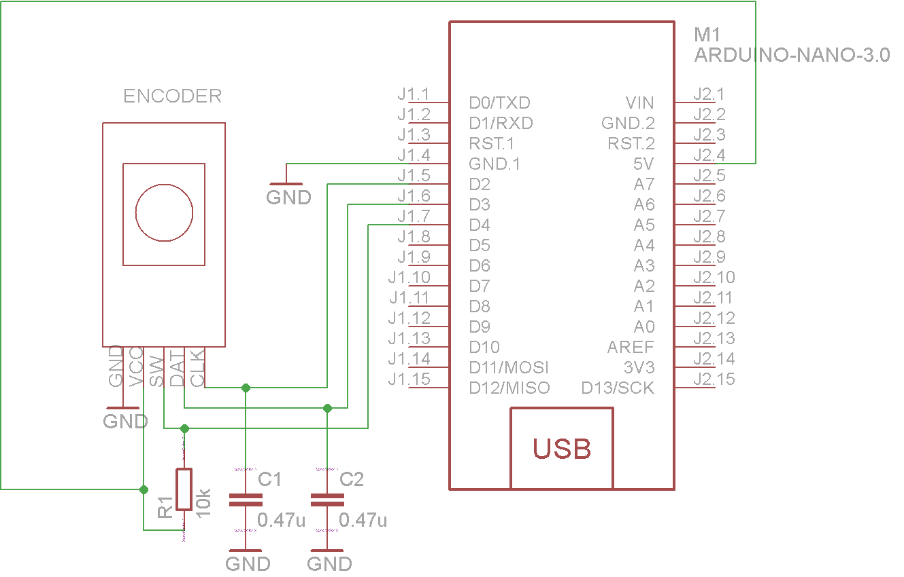

### Rotary Encoder

A rotary or "shaft" encoder is an angular measuring device. It is used to precisely measure rotation of motors or to create wheel controllers (knobs) that can turn infinitely (with no end stop like a potentiometer has). Some of them are also equipped with a pushbutton when you press on the axis (like the ones used for navigation on many music controllers). They come in all kinds of resolutions, from maybe 16 to at least 1024 steps per revolution.


#### Description

Below is an image showing the waveforms of the A & B channels of an encoder.


The two output wave forms are 90 degrees out of phase, which is what quadrature means. These signals are decoded to produce a count up pulse or a count down pulse. For decoding in software, the A & B outputs are read by software, either via an interrupt on any edge or polling, and the above table is used to decode the direction.

*In this case:*

The SW pin is the switch pin and goes high when the rotary encoder is pushed.
The CLK (clock) and DT (data) pins are how you read the direction the encoder has been turned. The CLK pin goes low when the encoder has been turned and the DT pin shows which was it has been turned, low for clockwise, high for anti clockwise.

### Raspberry PI usage:

#### Pinout


#### Wiring


### Arduino nano usage:

#### Pinout


#### Wiring



#### Example code
```

/* In the stopping positions the KY-040 has always HIGH
signals on both CLK and DT.
When you turn the encoder from one position to another,
either CLK or DT goes LOW before the other
signal goes LOW as well. The signal that
goes LOW first determines if the encoder is
turned left or right. Once you reach the next
stopping position both signals will be HIGH again.
If you press the push button, the current
count can be reset to ZERO. For faster response
you might increase the speed of the serial connection.
(Make sure, that the Serial Monitor is also set to
a higher speed, otherwise you will get no output).*/


volatile boolean TurnDetected;
volatile boolean up;

const int PinCLK=2;                   // Used for generating interrupts using CLK signal
const int PinDT=3;                    // Used for reading DT signal
const int PinSW=4;                    // Used for the push button switch

void isr ()  {                    // Interrupt service routine is executed when a HIGH to LOW transition is detected on CLK
 if (digitalRead(PinCLK))
   up = digitalRead(PinDT);
 else
   up = !digitalRead(PinDT);
 TurnDetected = true;
}


void setup ()  {
 pinMode(PinCLK,INPUT);
 pinMode(PinDT,INPUT);  
 pinMode(PinSW,INPUT);
 attachInterrupt (0,isr,FALLING);   // interrupt 0 is always connected to pin 2 on Arduino UNO
 Serial.begin (9600);
 Serial.println("Start");
}

void loop ()  {
 static long virtualPosition=0;    // without STATIC it does not count correctly!!!

 if (!(digitalRead(PinSW))) {      // check if pushbutton is pressed
   virtualPosition=0;              // if YES, then reset counter to ZERO
   Serial.print ("Reset = ");      // Using the word RESET instead of COUNT here to find out a buggy encoder

   Serial.println (virtualPosition);
 }  

 if (TurnDetected)  {		    // do this only if rotation was detected
   if (up)
     virtualPosition++;
   else
     virtualPosition--;
   TurnDetected = false;          // do NOT repeat IF loop until new rotation detected
   Serial.print ("Count = ");  
   Serial.println (virtualPosition);
 }
}
```
###### Source: arduino.cc
