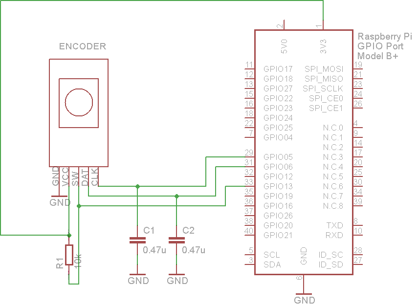

### Rotary Encoder

A rotary or "shaft" encoder is an angular measuring device. It is used to precisely measure rotation of motors or to create wheel controllers (knobs) that can turn infinitely (with no end stop like a potentiometer has). Some of them are also equipped with a pushbutton when you press on the axis (like the ones used for navigation on many music controllers). They come in all kinds of resolutions, from maybe 16 to at least 1024 steps per revolution.

#### Description

Below is an image showing the waveforms of the A & B channels of an encoder.

The two output wave forms are 90 degrees out of phase, which is what quadrature means. These signals are decoded to produce a count up pulse or a count down pulse. For decoding in software, the A & B outputs are read by software, either via an interrupt on any edge or polling, and the above table is used to decode the direction.

*In this case:*

The SW pin is the switch pin and goes high when the rotary encoder is pushed.
The CLK (clock) and DT (data) pins are how you read the direction the encoder has been turned. The CLK pin goes low when the encoder has been turned and the DT pin shows which was it has been turned, low for clockwise, high for anti clockwise.

#### Pinout

#### Wiring

###### Source: arduino.cc
