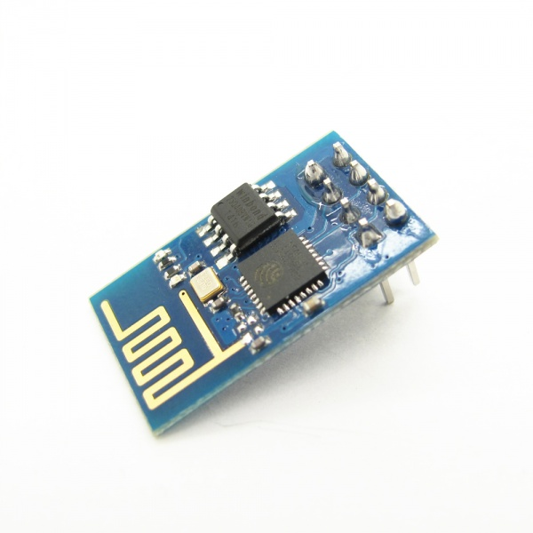
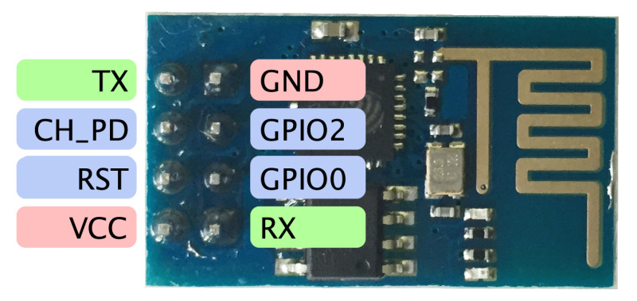
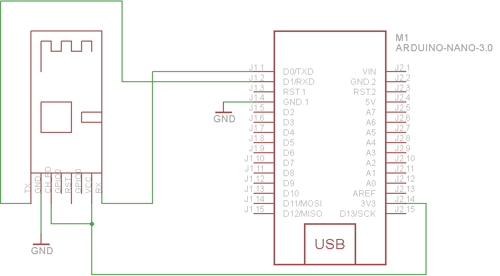

### ESP8266 Wifi module

ESP8266 offers a complete and self-contained Wi-Fi networking solution, allowing it to either host the application or to offload all Wi-Fi networking functions from another application processor.
When ESP8266 hosts the application, and when it is the only application processor in the device, it is able to boot up directly from an external flash. It has integrated cache to improve the performance of the system in such applications, and to minimize the memory requirements.



Alternately, serving as a Wi-Fi adapter, wireless internet access can be added to any microcontroller-based design with simple connectivity through UART interface or the CPU AHB bridge interface.

#### Features:

+ 802.11 b/g/n protocol
+ Wi-Fi Direct (P2P), soft-AP
+ Integrated TCP/IP protocol stack
+ Integrated TR switch, balun, LNA, power amplifier and matching network
+ Integrated PLL, regulators, and power management units
+ +19.5dBm output power in 802.11b mode
+ Integrated temperature sensor
+ Supports antenna diversity
+ Power down leakage current of < 10uA
+ Integrated low power 32-bit CPU could be used as application processor
+ SDIO 2.0, SPI, UART
+ STBC, 1×1 MIMO, 2×1 MIMO
+ A-MPDU & A-MSDU aggregation & 0.4s guard interval
+ Wake up and transmit packets in < 2ms
+ Standby power consumption of < 1.0mW (DTIM3)


### ESP8266 Serial Commands

Understanding the Serial Commands being sent to the ESP8266 is a great place to start learning about the ESP8266

The first thing we need to know is how to restart the chip.  To do this we send the following command:

``` AT+RST ```

Next will will want to set the chip as either a wireless client or as an access point.  In our case we are looking to become a client to validate whether or not a Web Server is available.  If we wanted to act as a wireless Access Point then we would need to set the mode to 2 instead and issue some other commands.  For now let’s stick to the client settings.

``` AT+CWMODE=1 ```

If we are using a serial connection to talk to the chip, at this point we would would probably want to check out what we can hear.  The ESP8266 provides the following command to list all of the available Wireless Access Points in the area which are broadcasting their SSID.

``` AT+CWLAP ```

Once we have established that our wireless network is out there, we need to connect to it.  To connect we simply issue the following command replacing SSID with the name of your wireless network and password with the WPA key used to secure your network.

``` AT+CWJAP=”SSID”,”PASSWORD” ```

You should now be connected!  If you have that serial terminal still open, you can ask the WiFi module for its current IP address by issuing the command;

``` AT+CWLIF ```

### Querry Web Page

The first thing we need to do is establish a connection to the webserver.  To do this you use the following command while obviously replacing the IP address with that of your web server.  In our case we are using standard HTTP (NOT SSL/HTTPS) therefore our port is 80.  I am not sure how this would work over SSL so if you figure it out please post in the comments below.

``` AT+CIPSTART=”TCP”,”192.168.88.35″, 80 ```

Next we need to let the WiFi module know how many characters we are sending in our query.  To do this we issue a command like the following

``` AT+CIPSEND=50 ```

Finally we can perform an HTTP get against the server. Note the number 50 above is the total number of characters in this command.  We count \r & \n as single characters and we do not count the last \r\n sequence.

``` GET /status.html HTTP/1.0\r\nHost: 192.168.88.35\r\n\r\n ```

This should result in a response from the webserver.  The last step left is to be proper citizens and close the connection by issuing the following command.

``` AT+CIPCLOSE ```

This is very cool stuff!  Now lets move this into something usefull and start writing some Arduino code.


### Arduino nano usage:

#### Pinout




#### Wiring



 ### IMPORTANT: You should be aware that while flashing the Arduino you must power down or disconnect the ESP8266 as it can cause problems while flashing your Arduino.

#### Example code
```
//my web site, replace with yours
#define DST_IP "192.168.88.35"

//Define the pin for the on board LED
int led = 13;

//Initialize Device
void setup()
{
//Enable the Onboard LED to act as a Status indicator light
pinMode(led,OUTPUT);
//Set the speed for communicating with the ESP8266 module
Serial.begin(9600);
//Send a series of flashes to show us we are in the bootup phase.
blinkcode ();
//Reset the ESP8266
Serial.println("AT+RST");
//Wait for the WiFi module to bootup
delay(800);
//Switch the chip to "client" mode
Serial.println("AT+CWMODE=1");
//Connect to our Wireless network NOTE: change SSID to your wireless
//network and PASSWORD to the key used to join the network.
Serial.println("AT+CWJAP=\"SSID\",\"PASSWORD\"");
//Once again blink some lights because it is fun!
blinkcode ();
}

void loop()
{
//Open a connection to the web server
String cmd = "AT+CIPSTART=\"TCP\",\""; //make this command: AT+CPISTART="TCP","192.168.88.35",80
cmd += DST_IP;
cmd += "\",80";
Serial.println(cmd);

//wait a little while for 'Linked'
delay(300);

//This is our HTTP GET Request change to the page and server you want to load.
cmd = "GET /status.html HTTP/1.0\r\n";
cmd += "Host: 192.168.88.35\r\n\r\n";

//The ESP8266 needs to know the size of the GET request
Serial.print("AT+CIPSEND=");
Serial.println(cmd.length());

//Look for the > prompt from the esp8266
if(Serial.find(">"))
{
//Send our http GET request
Serial.println(cmd);
}
else
{
//Something didn't work...
Serial.println("AT+CIPCLOSE");
}

//Check the returned header & web page. Looking for a keyword. I used YES12321

if (Serial.find("YES12321"))
{
//If the string was found we know the page is up and we turn on the LED status
//light to show the server is ONLINE
digitalWrite(led,HIGH);
}
else
{
//If the string was not found then we can assume the server is offline therefore
//we should turn of the light.
digitalWrite(led,LOW);
}
//Wait a second for everything to settle.
delay(1000);
//Be great people and close our connection.
Serial.println("AT+CIPCLOSE");

//Introduce a delay timer before we finish and go back to the begining.
delay (5000);
}

void blinkcode ()
{
//Simply loop a few times flashing the status light (this is used during boot up)
int i;
for (i = 1; i <= 10; i++){
delay (100);
digitalWrite(led,HIGH);
delay (100);
digitalWrite(led,LOW);
}
}
```
