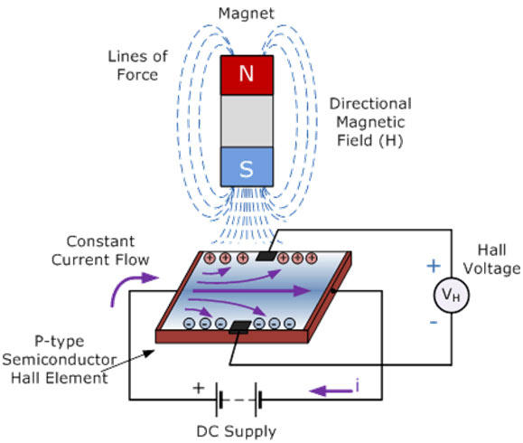
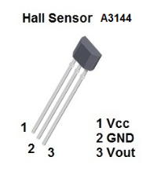
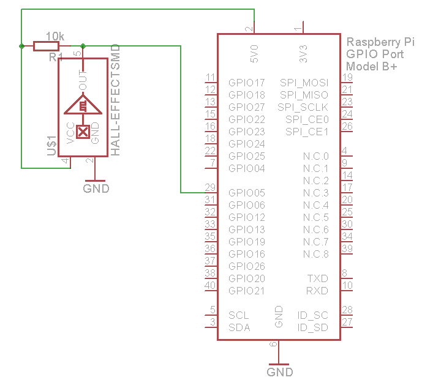
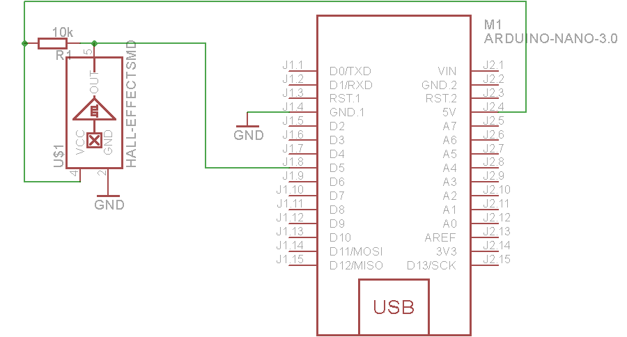

### Hall Effect sensor

A Hall effect sensor is a transducer that varies its output voltage in response to a magnetic field. Hall effect sensors are used for proximity switching, positioning, speed detection, and current sensing applications.


In its simplest form, the sensor operates as an analog transducer, directly returning a voltage. With a known magnetic field, its distance from the Hall plate can be determined.



Frequently, a Hall sensor is combined with circuitry that allows the device to act in a digital (on/off) mode, and may be called a switch in this configuration.

### Raspberry PI usage:

#### Pinout




#### Wiring



### Arduino nano usage:

#### Pinout


#### Wiring



#### Example code
```
int hallPin=5;

int statePin=LOW;


void setup()
{
pinMode(hallPin,INPUT);
Serial.begin(9600);
}

void loop()
{
statePin=digitalRead(hallPin);
if (Serial.available())
{
if( statePin==HIGH)
{
Serial.println("North");
}
else if(statePin==LOW)
{
Serial.println("South");
}
}
delay(500);
}
```

###### Source:
[Here](http://wikipedia.org), [Here](http://engineersgarage.com)
