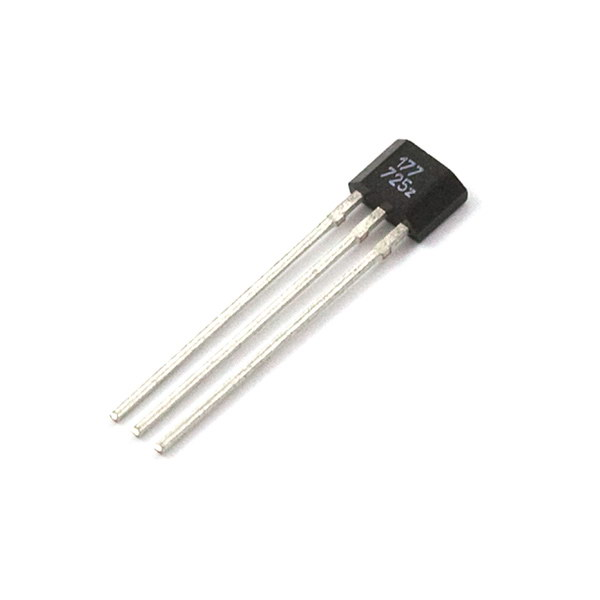

### Hall Effect sensor

A Hall effect sensor is a transducer that varies its output voltage in response to a magnetic field. Hall effect sensors are used for proximity switching, positioning, speed detection, and current sensing applications.

In its simplest form, the sensor operates as an analog transducer, directly returning a voltage. With a known magnetic field, its distance from the Hall plate can be determined.

Frequently, a Hall sensor is combined with circuitry that allows the device to act in a digital (on/off) mode, and may be called a switch in this configuration.

#### Pinout

#### Wiring

###### Source: wikipedia.com, engineersgarage.com
