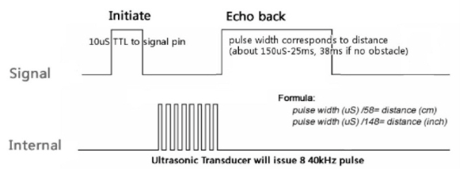
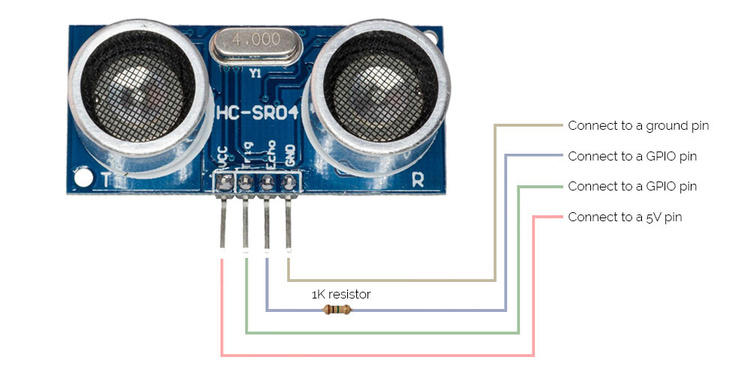
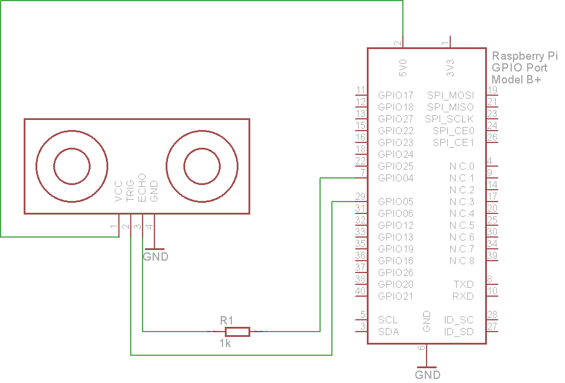

### HC-SR04 ultrasonic sensor

The HC-SR04 ultrasonic sensor uses sonar to determine distance to an object like bats or dolphins do. It offers excellent non-contact range detection with high accuracy and stable readings in an easy-to-use package. From 2cm to 400 cm

#### Features:
+ Power Supply :+5V DC
+ Quiescent Current : <2mA
+ Working Current: 15mA
+ Effectual Angle: <15°
+ Ranging Distance : 2cm – 400 cm/1" - 13ft
+ Resolution : 0.3 cm
+ Measuring Angle: 30 degree
+ Trigger Input Pulse width: 10uS
+ Dimension: 45mm x 20mm x 15mm

The timing diagram of HC-SR04 is shown. To start measurement, Trig of SR04 must receive a pulse of high (5V) for at least 10us, this will initiate the sensor will transmit out 8 cycle of ultrasonic burst at 40kHz and wait for the reflected ultrasonic burst. When the sensor detected ultrasonic from receiver, it will set the Echo pin to high (5V) and delay for a period (width) which proportion to distance. To obtain the distance, measure the width (Ton) of Echo pin.

+ Time = Width of Echo pulse, in uS (micro second)
+ Distance in centimeters = Time / 58
+ Distance in inches = Time / 148
+ Or you can utilize the speed of sound, which is 340m/s




### Raspberry PI usage:

#### Pinout


#### Wiring




***Note:***
* Please connect the GND pin first before supplying power to VCC.
Please make sure the surface of object to be detect should have at least 0.5 meter2 for better performance.***

### Arduino nano usage:

#### Pinout


#### Wiring


#### Example code
```
const int trigPin = 8;
const int echoPin = 7;

void setup() {
  // initialize serial communication:
  Serial.begin(9600);
  pinMode(trigPin,OUTPUT);
  pinMode(echoPin,INPUT);
}

void loop()
{
  long duration, inches, cm;

  digitalWrite(trigPin, LOW);
  delayMicroseconds(2);
  digitalWrite(trigPin, HIGH);
  delayMicroseconds(5);
  digitalWrite(trigPin, LOW);

  duration = pulseIn(echoPin, HIGH);

  // convert the time into a distance
  inches = microsecondsToInches(duration);
  cm = microsecondsToCentimeters(duration);

  Serial.print(inches);
  Serial.print("in, ");
  Serial.print(cm);
  Serial.print("cm");
  Serial.println();

  delay(100);
}

long microsecondsToInches(long microseconds)
{
  // According to Parallax's datasheet for the PING))), there are
  // 73.746 microseconds per inch (i.e. sound travels at 1130 feet per
  // second).  This gives the distance travelled by the ping, outbound
  // and return, so we divide by 2 to get the distance of the obstacle.
  // See: http://www.parallax.com/dl/docs/prod/acc/28015-PING-v1.3.pdf
  return microseconds / 74 / 2;
}

long microsecondsToCentimeters(long microseconds)
{
  // The speed of sound is 340 m/s or 29 microseconds per centimeter.
  // The ping travels out and back, so to find the distance of the
  // object we take half of the distance travelled.
  return microseconds / 29 / 2;
}
```

##### Source:
[Here](https://docs.google.com/document/d/1Y-yZnNhMYy7rwhAgyL_pfa39RsB-x2qR4vP8saG73rE/edit?pli=1),
[Here](http://robotic-controls.com/book/export/html/16)
