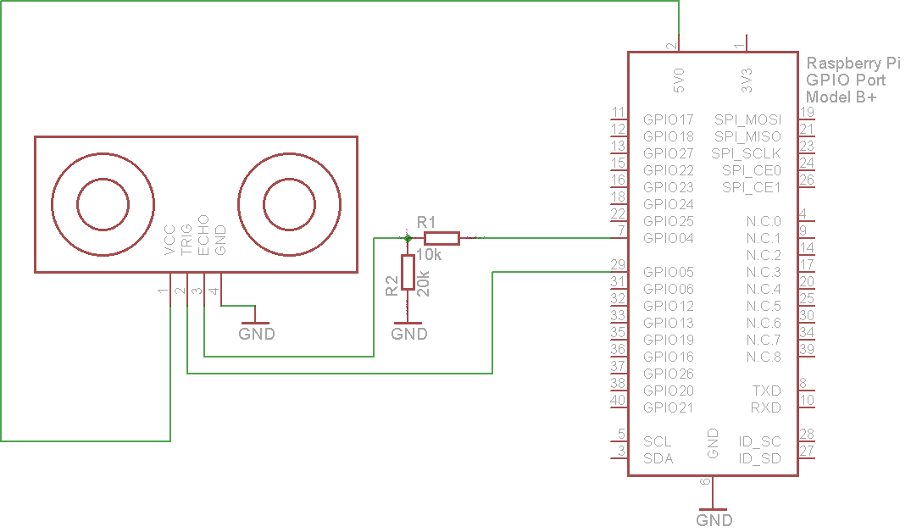

### HC-SR04 ultrasonic sensor

The HC-SR04 ultrasonic sensor uses sonar to determine distance to an object like bats or dolphins do. It offers excellent non-contact range detection with high accuracy and stable readings in an easy-to-use package. From 2cm to 400 cm

#### Features:
+ Power Supply :+5V DC
+ Quiescent Current : <2mA
+ Working Current: 15mA
+ Effectual Angle: <15°
+ Ranging Distance : 2cm – 400 cm/1" - 13ft
+ Resolution : 0.3 cm
+ Measuring Angle: 30 degree
+ Trigger Input Pulse width: 10uS
+ Dimension: 45mm x 20mm x 15mm

#### Pinout

#### Wiring

The timing diagram of HC-SR04 is shown. To start measurement, Trig of SR04 must receive a pulse of high (5V) for at least 10us, this will initiate the sensor will transmit out 8 cycle of ultrasonic burst at 40kHz and wait for the reflected ultrasonic burst. When the sensor detected ultrasonic from receiver, it will set the Echo pin to high (5V) and delay for a period (width) which proportion to distance. To obtain the distance, measure the width (Ton) of Echo pin.

+ Time = Width of Echo pulse, in uS (micro second)
+ Distance in centimeters = Time / 58
+ Distance in inches = Time / 148
+ Or you can utilize the speed of sound, which is 340m/s

***Note:***
* Please connect the GND pin first before supplying power to VCC.
Please make sure the surface of object to be detect should have at least 0.5 meter2 for better performance.***

#####Source:
[Here](https://docs.google.com/document/d/1Y-yZnNhMYy7rwhAgyL_pfa39RsB-x2qR4vP8saG73rE/edit?pli=1)
