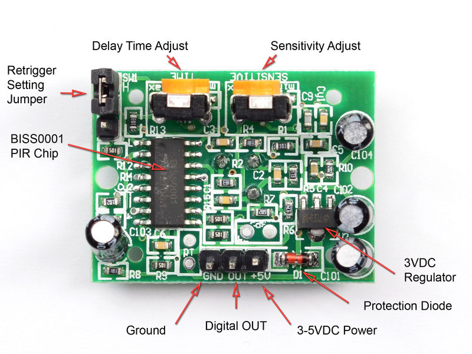
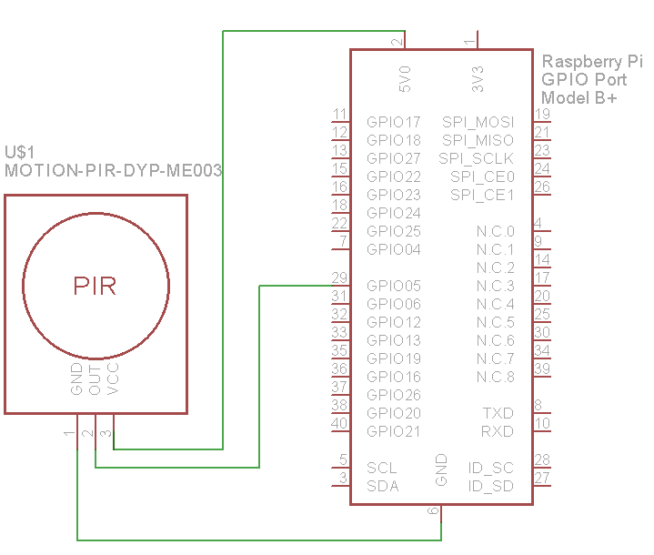
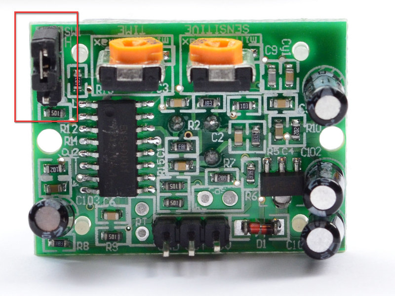
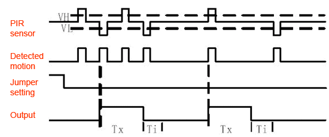
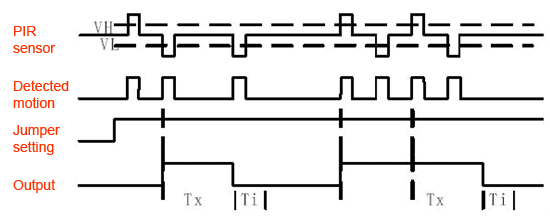

### **HC-SR501 PIR sensor**

PIR sensors allow you to sense motion, almost always used to detect whether a human has moved in or out of the sensors range.

#### Features:

+ Output: Digital pulse high (3V) when triggered (motion detected) digital low when idle (no motion detected). Pulse lengths are determined by resistors and capacitors on the PCB and differ from sensor to sensor.
+ Sensitivity range: up to 20 feet (6 meters) 110 degrees x 70 degrees detection range
+ Power supply: 3.3V - 5V input voltage

#### **Wiring, DO and Retriggering**

Pinout

Wiring

Jumper settings

When connecting up the PIR sensor as above, the DO (Digital OUT) does not stay on HIGH level when moving in front of it but actually turns HIGH and LOW every second or so. That is called "non-retriggering".

When change the jumper, so that it is in the H position. You will notice that now the DO does stay HIGH level the entire time that something is moving. That is called "retriggering".

