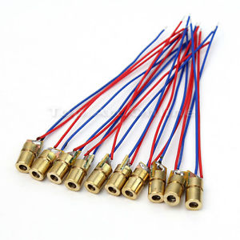
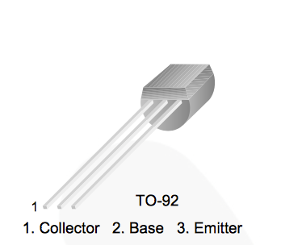
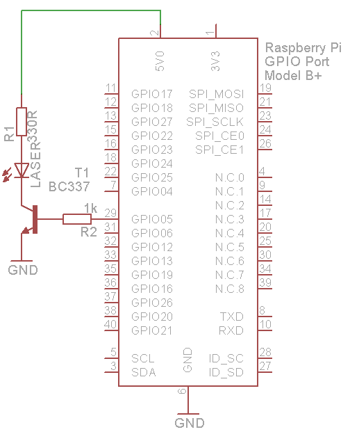

### Laser Diode

A laser diode, or LD, is an electrically pumped semiconductor laser in which the active laser medium is formed by a p-n junction of a semiconductor diode similar to that found in a light-emitting diode.

#### Safety information!

The GPIO pins are connected directly to the BCM2835 chip at the heart of the Raspberry Pi. These provide only a 3.3V output level, and are not capable of supplying much power. More importantly, if they are damaged through misuse the Pi itself will need to be replaced.

So, if you are connecting anything more than a small LED to the GPIO output, you should use an additional circuit to boost the voltage and/or current.

#### Pinout

#### Wiring

###### Source: wikipedia.com
