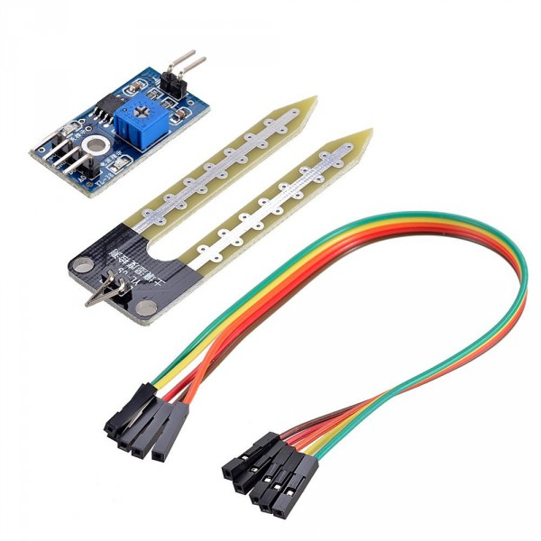
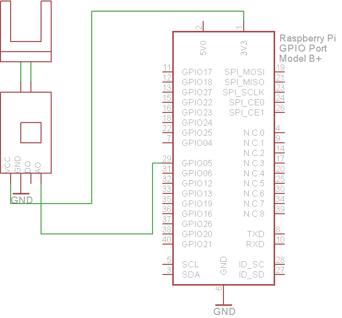

### Soil moisture sensor

Soil moisture sensors measure the volumetric water content in soil.[1] Since the direct gravimetric measurement of free soil moisture requires removing, drying, and weighting of a sample, soil moisture sensors measure the volumetric water content indirectly by using some other property of the soil, such as electrical resistance, dielectric constant, or interaction with neutrons, as a proxy for the moisture content.

#### Features

* This is a simple water sensor can be used to detect soil moisture when the soil moisture deficit module outputs a high level, and vice versa output low. Use this sensor produced an automatic plant waterer device, so that the plants in your garden without people to manage.
* Sensitivity adjustable the blue digital potentiometer adjustment (Figure)
* Operating voltage 3.3V-5V
* Module dual output mode, digital output, analog output more accurate.
* Power indicator (red) and digital switching output indicator (green)
* VCC: 3.3 V-5V
* GND: GND
* DO: digital output interface (0 and 1)
* AO: Analog Output Interface

#### Description

* Sensor in air: value = 0
* Sensor in dry soil:  0 < value  < 300
* Sensor in humid soil: 300 < value < 700
* Sensor in water: value > 700

#### Pinout

#### Wiring

###### Source: wikipedia.org
