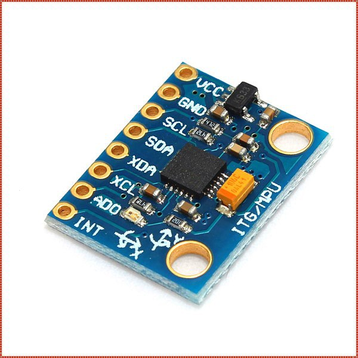
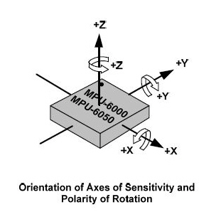
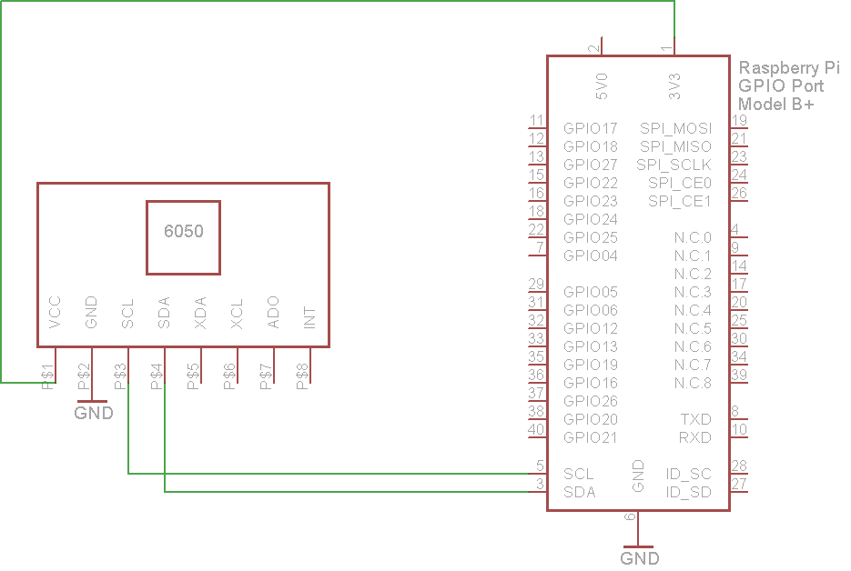

### MPU-6050 (GY-521)

The MPU-6050 devices combine a 3-axis gyroscope and a 3-axis accelerometer on the same silicon die, together with an onboard Digital Motion Processor™ (DMP™), which processes complex 6-axis MotionFusion algorithms. The device can access external magnetometers or other sensors through an auxiliary master I²C bus, allowing the devices to gather a full set of sensor data without intervention from the system processor.

####Axes review:

#### Features:

I2C Digital-output of 6 or 9-axis MotionFusion data in rotation matrix, quaternion, Euler Angle, or raw data format
Input Voltage: 2.3 - 3.4V
Selectable Solder Jumpers on CLK, FSYNC and AD0
Tri-Axis angular rate sensor (gyro) with a sensitivity up to 131 LSBs/dps and a full-scale range of ±250, ±500, ±1000, and ±2000dps
Tri-Axis accelerometer with a programmable full scale range of ±2g, ±4g, ±8g and ±16g
Digital Motion Processing™ (DMP™) engine offloads complex MotionFusion, sensor timing synchronization and gesture detection
Embedded algorithms for run-time bias and compass calibration. No user intervention required
Digital-output temperature sensor

#### Pinout

#### Wiring

