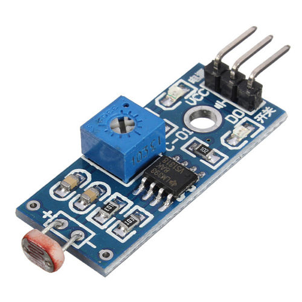
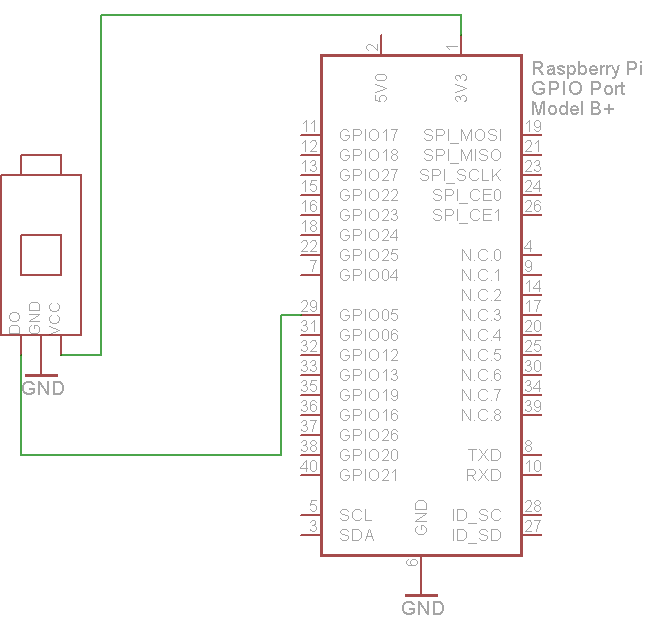

### Photoresistor

A photoresistor, or light-dependent resistor (LDR), or photocell is a resistor whose resistance will decrease when incident light intensity increase; in other words, it exhibits photoconductivity.

Basically we'll be able to measure how bright or dark the room is using the photocell. Note that photocells are not precision measurement devices, and this technique is also not very precise so its only good for basic measurements.

#### Features

* working voltage: 3.3~5V
* output: digital switching  (LOW or HIGH voltage on D pin)
* output current >= 15mA, can directly light LED.
* with adjustable potentiometer to adjust the sensitivity

#### Pinout

#### Wiring

###### Source: uugear.com
