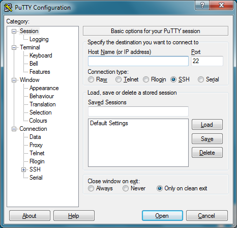
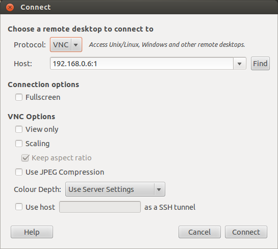

# Raspberry PI 1 (model: B+)

The Raspberry Pi is a series of credit card–sized single-board computers developed in the UK.
The Foundation provides Debian and Arch Linux ARM distributions for download. Tools are available for Python as the main programming language, with support for BBC BASIC (via the RISC OS image or the Brandy Basic clone for Linux), C, C++, Java Perl and Ruby.

#### Pinout

#### Power supply
* Use a 5V micro USB power supply to power your Raspberry Pi.

##Connect to Raspberry Pi
### SSH USING WINDOWS

On Windows you will need to download an SSH client. The most commonly used one is called PuTTY and can be downloaded from [greenend.org.uk](http://greenend.org.uk)

Look for putty.exe under the heading For Windows on Intel x86.

It doesn't have an installer package, it's just a standalone .exe file. When you run it you'll see the configuration screen below:

Type the IP address of the Pi into the Host Name field and click the Open button. If nothing happens for a while when you click the Open button and eventually see a message saying Network error: Connection timed out it's likely that you've entered the wrong IP address for the Pi.

If you don't know the IP address just type hostname `-I `in the Raspberry Pi command line. See more methods of finding your IP address.

When the connection works you'll see this security warning (below), you can safely ignore it and click the Yes button. You'll only see this warning the first time when PuTTY connects to a Pi that it has never seen before.

You'll now have the usual login prompt, login with the same username and password as you would use on the Pi itself. The default login for Raspbian is `pi` with the password `raspberry`.

You should now have the Raspberry Pi prompt which will be identical to the one found on the Raspberry Pi itself.

`pi@raspberrypi ~ $`

### SSH USING LINUX OR MAC OS

You can use SSH to connect to your Raspberry Pi from a Linux computer or Mac (or another Pi) from the Terminal, without installing additional software.

To connect to your Pi from a different computer, copy and paste the following command into the terminal window but replace `<IP>` with the IP address of the Raspberry Pi. Use Ctrl + Shift + V to paste in the terminal.

`ssh pi@<IP>`
If you receive a connection timed out error it's likely that you've entered the wrong IP address for the Raspberry Pi.

When the connection works you'll see a security/authenticity warning. Type yes to continue. You'll only see this warning the first time you connect.

In the event your Pi has taken the IP address of a device to which your computer has connected before (even on another network), you may be given a warning and asked to clear the record from your list of known devices. Following this instruction and trying the ssh command again should be successful.

Next you'll be prompted for the password for the `pi` login, by default on Raspbian the password is `raspberry`. You should now have the Raspberry Pi prompt which will be identical to the one found on the Raspberry Pi itself.

If you have set up another user on the Pi, you can connect to it the same way, replacing the username with your own, e.g. `eben@192.168.1.5`

`pi@raspberrypi ~ $`
You are now connected to the Pi remotely and can execute commands.

For further documentation on the ssh command just enter man ssh into the Terminal.

### VNC (VIRTUAL NETWORK COMPUTING)

VNC is a graphical desktop sharing system that allows you to remotely control the desktop interface of one computer from another. It transmits the keyboard and mouse events from the controller, and receives updates to the screen over the network from the remote host.

#### CONNECTING TO A PI OVER VNC USING Windows

On Windows you'll need to download and install a VNC client program. A commonly used one is TightVNC which can be downloaded from [tightvnc.com](http://tightvnc.com)

Choose either the 32 or 64 bit download depending on which version of Windows you are using. If you don't know then check by looking at System in Control Panel. Download the installer file and run it.

During installation you'll be offered the choice of Typical, Custom or Complete. You only need the VNC client and not the server, so choose Custom. Then select TightVNC Server and choose Entire feature will be unavailable. Click Next. Uncheck the option about Windows Firewall and click Next again, then Install.

Once the installation is complete you should find TightVNC Viewer under the start menu. When you run it you'll be presented with the dialog below. You will need to enter the IP address of the Raspberry Pi followed by the screen number (:0 or :1). For example: 192.168.0.6:1

Click the Connect button and you will be prompted for the password that was specified when configuring the VNC server on the Raspberry Pi earlier. You should then find yourself at the Raspberry Pi desktop.

Don't use the logout menu as you would on the Raspberry Pi desktop when you want to close down. Just close the TightVNC window itself and then use the kill command on the Raspberry Pi, described above, to shut down the VNC server.

#### CONNECTING TO A PI OVER VNC USING MAC OS

For Mac OS you'll need to install a VNC viewer program. You can use Screen Sharing (which comes installed as standard) but this takes a bit more configuration to get working. There is a program called RealVNC which is known to work with the Raspberry Pi VNC server, it can be downloaded from [realvnc.com](http://realvnc.com)

Download the package file and open it. During the setup you'll be offered a choice of the type of installation. You only need the VNC viewer on your Mac and not the server so select custom and then uncheck VNC Server (see below).

Click Continue and go ahead with the rest of the installation. Once the installation is complete open the finder, then select Applications on the left and enter vnc into the search box. VNC Viewer should then be shown. Perhaps create a shortcut to it in your Dock for future use.

When you run it you'll be presented with the dialog above. You will need to enter the IP address of the Raspberry Pi followed by the screen number (:0 or :1). For example: 192.168.0.165:1

Click the Connect button and you'll be given an unencrypted connection warning.

Generally speaking this warning only needs consideration if the connection between your Mac and the Pi is going over the Internet. If you're using a Local Area Network or a School network then you don't really need to worry. Click Continue and you'll be prompted for the password that was specified when configuring the VNC server on the Raspberry Pi earlier. You should then find yourself at the Raspberry Pi desktop.

Don't use the logout menu as you would on the Raspberry Pi desktop when you want to close down. Just close the RealVNC window itself and then use the kill command on the Raspberry Pi, described above, to shut down the VNC server.

#### CONNECTING TO A PI OVER VNC USING LINUX

It is likely that your Linux distribution ships with a Remote Desktop Viewer application you can use to connect to your Pi using VNC. This can usually be found under the Applications / Internet menu (see the Ubuntu example below).

Once you have the Remote Desktop Viewer open click the connect button and you'll be see the following dialog. Set the Protocol option to VNC and enter the IP address of the Raspberry Pi followed by the screen number (:0 or :1). For example: 192.168.0.6:1

Click the Connect button and you will be prompted for the password that was specified when configuring the VNC server on the Raspberry Pi earlier. You should then find yourself at the Raspberry Pi desktop.

Don't use the logout menu as you would on the Raspberry Pi desktop when you want to close down. Just close the Remote Desktop Viewer window itself and then use the kill command on the Raspberry Pi, described above, to shut down the VNC server.

###### Source: www.raspberrypi.org, wikipedia.org
