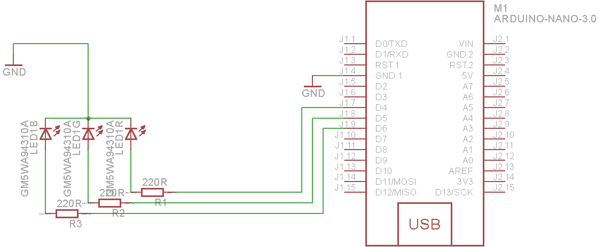

### RGB LED

RGB LED is simply three separate LEDs crammed into a single 5mm LED package. There is one each of red, green, and blue LED elements. These three LEDs share the same negative (cathode) terminal, which means that this RGB LED has a "common cathode" connection. To control each color, simply connect its anode pin to Arduino Pinout (through a resistor - 220 Ohms is usually good), and it will light up. Be sure to use current-limiting resistors to protect the LEDs from burning out, and you can also use pulse-width modulation to change the brightness of an LED.


### Raspberry PI usage:

#### Pinout


#### Wiring


### Arduino nano usage:

#### Pinout


#### Wiring



#### Example code
```
int redPin = 4;
int greenPin = 5;
int bluePin = 6;

//uncomment this line if using a Common Anode LED
//#define COMMON_ANODE

void setup()
{
  pinMode(redPin, OUTPUT);
  pinMode(greenPin, OUTPUT);
  pinMode(bluePin, OUTPUT);  
}

void loop()
{
  setColor(255, 0, 0);  // red
  delay(1000);
  setColor(0, 255, 0);  // green
  delay(1000);
  setColor(0, 0, 255);  // blue
  delay(1000);
  setColor(255, 255, 0);  // yellow
  delay(1000);  
  setColor(80, 0, 80);  // purple
  delay(1000);
  setColor(0, 255, 255);  // aqua
  delay(1000);
}

void setColor(int red, int green, int blue)
{
  #ifdef COMMON_ANODE
    red = 255 - red;
    green = 255 - green;
    blue = 255 - blue;
  #endif
  analogWrite(redPin, red);
  analogWrite(greenPin, green);
analogWrite(bluePin, blue);  
}
```

###### Source:
[Here](http://adafruit.com)
