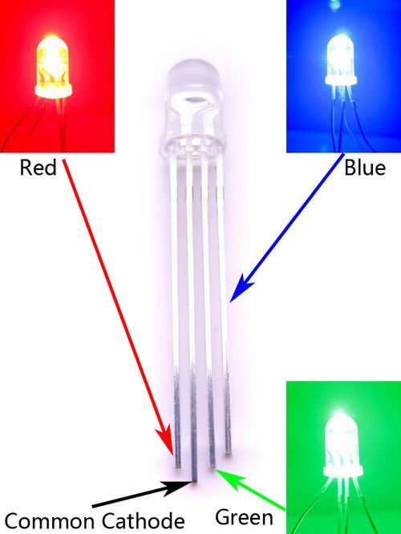
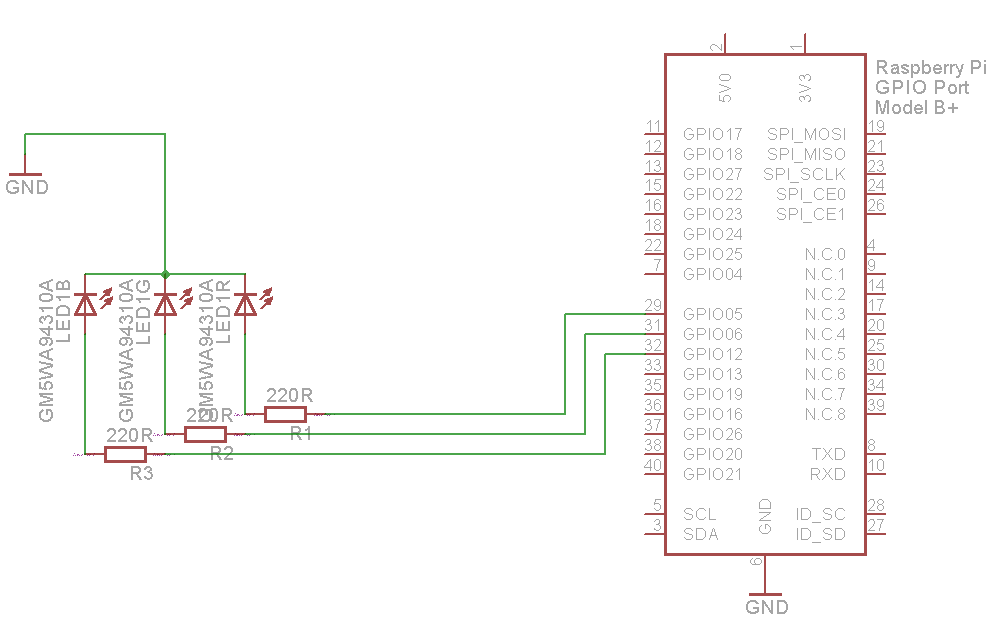

### RGB LED

RGB LED is simply three separate LEDs crammed into a single 5mm LED package. There is one each of red, green, and blue LED elements. These three LEDs share the same negative (cathode) terminal, which means that this RGB LED has a "common cathode" connection. To control each color, simply connect its anode pin to Arduino Pinout (through a resistor - 220 Ohms is usually good), and it will light up. Be sure to use current-limiting resistors to protect the LEDs from burning out, and you can also use pulse-width modulation to change the brightness of an LED.

#### Pinout

#### Wiring

