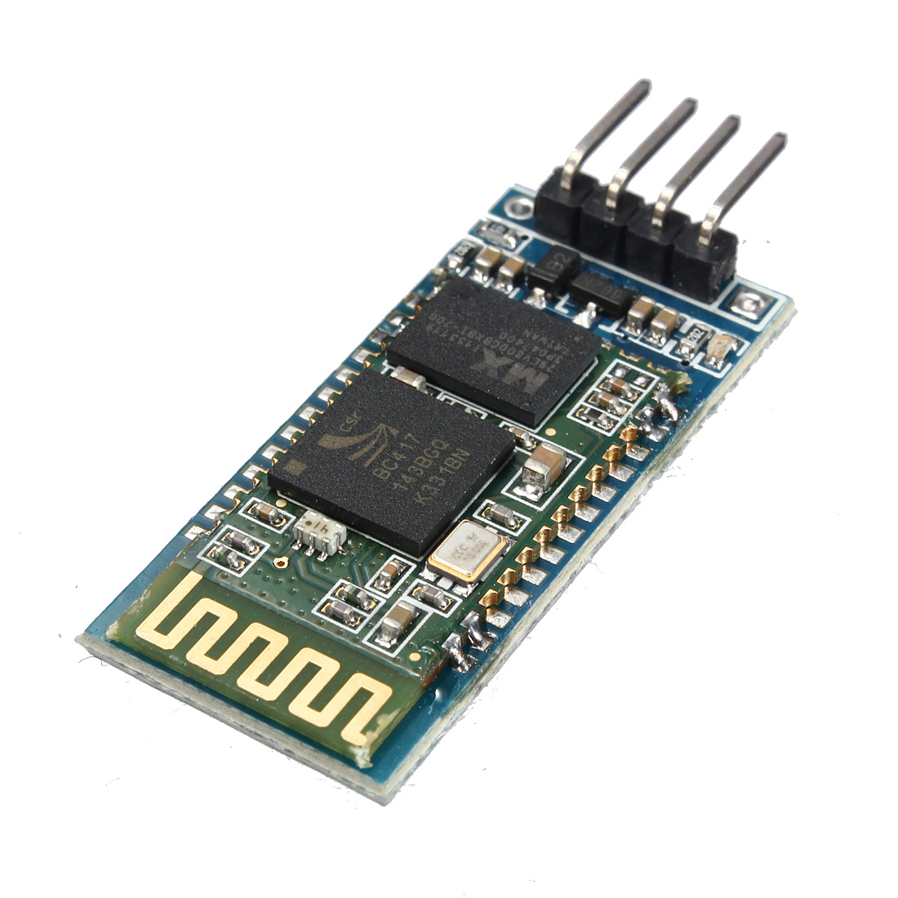
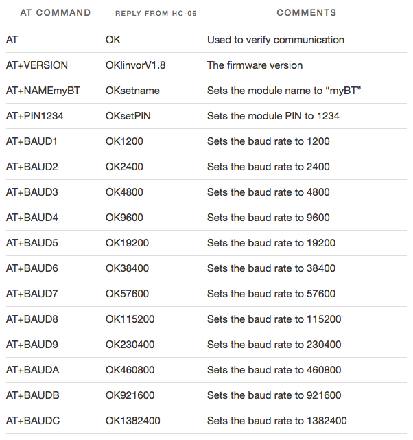
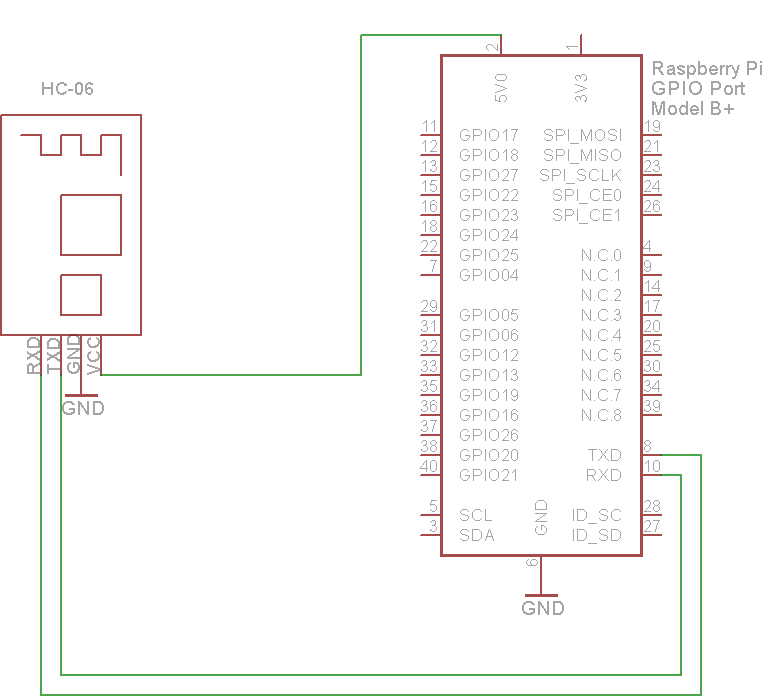
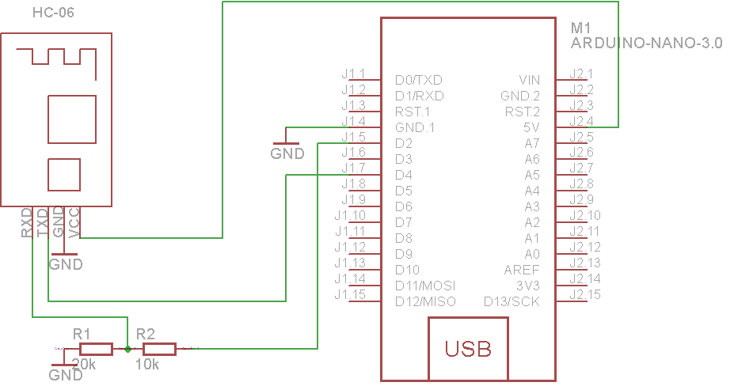

### Serial Bluetooth module (HC-06)

This module permits any microcontroller with a standard RS232 serial port to communicate with a PC or a Smartphone (Only Android) equipped with a Bluetooth Master module. Its main specifications are:



* Operating Voltage: 5 volt, reduced to 3.3 volts, @ 8 ma.
* Default baud rate: 9600 bps.
* Default pin: 1234
* Default name: Kibu(team table number)
* Class: 2, with up to 10 meter coverage.

Support to establish a Bluetooth connection through AT commands set the baud rate, passkey, set parameters are saved after. Bluetooth connection is automatically switched to the pass-through mode.

Reading serial data on Android with [BlueTerm](https://play.google.com/store/apps/details?id=es.pymasde.blueterm)



### Raspberry PI usage:

#### Pinout


#### Wiring



### Arduino nano usage:

#### Pinout


#### Wiring



#### Example code
```
String message; //string that stores the incoming message

void setup()
{
  Serial.begin(9600); //set baud rate
}

void loop()
{
  while(Serial.available())
  {//while there is data available on the serial monitor
    message+=char(Serial.read());//store string from serial command
  }
  if(!Serial.available())
  {
    if(message!="")
    {//if data is available
      Serial.println(message); //show the data
      message=""; //clear the data
    }
  }
  delay(5000); //delay
}
```
###### Source:
[Here](http://42bots.com/tutorials/hc-06-bluetooth-module-datasheet-and-configuration-with-arduino/)
