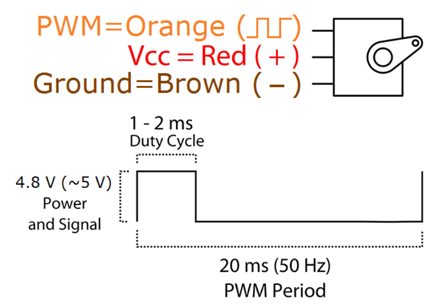
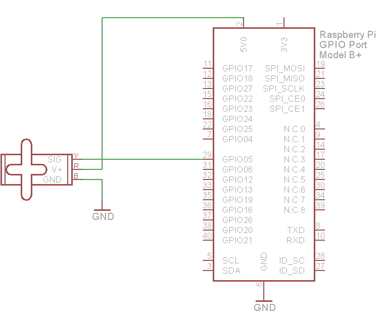

### Servo Motor (SG-90)

Servo can rotate approximately 180 degrees (90 in each direction), and works just like the standard kinds but smaller. You can use any servo code, hardware or library to control these servos.

#### Features:

* Dimension: 22.2 x 11.8 x 31 mm approx.
* Stall torque: 1.8 kgf·cm
* Operating speed: 0.1 s/60 degree
* Operating voltage: 4.8 V (~5V)
* Dead band width: 10 μs

Position "0" (1.5 ms pulse) is middle, "90" (~2 ms pulse) is all the way to the right, "-90" (~1 ms pulse) is all the way to the left.

#### Pinout

#### Wiring

