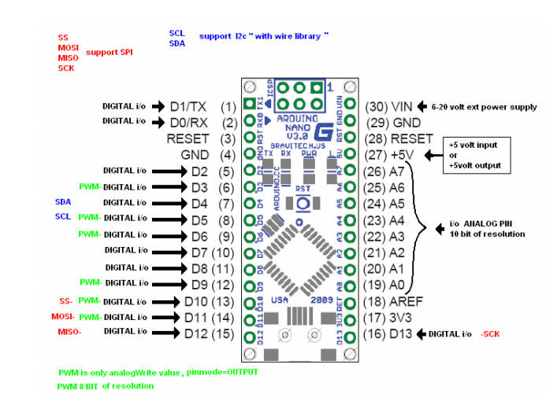

### Servo Motor (SG-90)

Servo can rotate approximately 180 degrees (90 in each direction), and works just like the standard kinds but smaller. You can use any servo code, hardware or library to control these servos.

#### Features:

* Dimension: 22.2 x 11.8 x 31 mm approx.
* Stall torque: 1.8 kgf·cm
* Operating speed: 0.1 s/60 degree
* Operating voltage: 4.8 V (~5V)
* Dead band width: 10 μs

Position "0" (1.5 ms pulse) is middle, "90" (~2 ms pulse) is all the way to the right, "-90" (~1 ms pulse) is all the way to the left.


### Raspberry PI usage:

#### Pinout


#### Wiring


### Arduino nano usage:

#### Pinout



#### Wiring


#### Example code
```
#include <Servo.h>

Servo myservo;  // create servo object to control a servo
                // a maximum of eight servo objects can be created

int pos = 0;    // variable to store the servo position

void setup()
{
  myservo.attach(5);  // attaches the servo on pin 5 to the servo object
}


void loop()
{
  for(pos = 0; pos < 180; pos += 1)  // goes from 0 degrees to 180 degrees
  {                                  // in steps of 1 degree
    myservo.write(pos);              // tell servo to go to position in variable 'pos'
    delay(15);                       // waits 15ms for the servo to reach the position
  }
  for(pos = 180; pos>=1; pos-=1)     // goes from 180 degrees to 0 degrees
  {
    myservo.write(pos);              // tell servo to go to position in variable 'pos'
    delay(15);                       // waits 15ms for the servo to reach the position
  }
}
```

###### Source:
[Here](http://magnusglad.wordpress.com/2013/03/13/tested-my-sg90-servo-today/)
