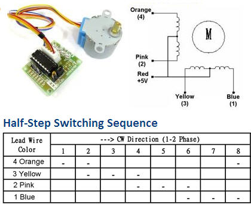
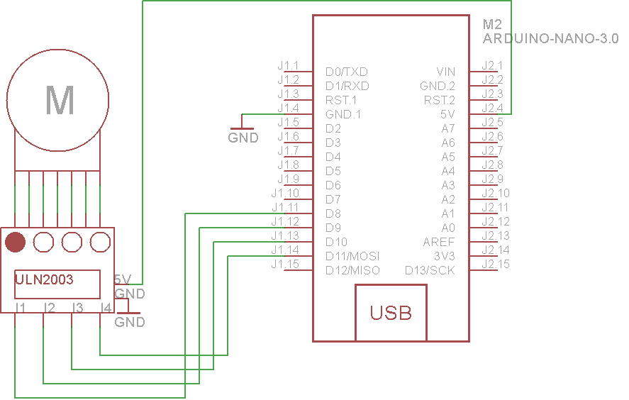

### Stepper Motor (28BYJ-48) and Driver (ULN2003)

The 28BYJ-48 is a small 5 volt geared stepping motors. These stepping motors are apparently widely used to control things like automated blinds, A/C units and are mass produced. Due to the gear reduction ratio of *approximately* 64:1 it offers decent torque for its size at speeds of about 15 rotations per minute (RPM).


#### Features:

* The rotation angle of the motor is proportional to the input pulse.
* The motor has full torque at standstill(if the windings are energized)
* Precise positioning and repeatability of movement since good stepper motors have an accuracy of – 5% of a step and this error is non cumulative from one step to the next.
* Excellent response to starting/stopping/reversing.
* Very reliable since there are no contact brushes in the motor.
* Therefore the life of the motor is simply dependant on the life of the bearing.
* The motors response to digital input pulses provides open-loop control, making the motor simpler and less costly to control.
* It is possible to achieve very low speed synchronous rotation with a load that is directly coupled to the shaft.
* A wide range of rotational speeds can be realized as the speed is proportional to the frequency of the input pulses.

#### Parameters:

* **Motor Type:** Unipolar stepper motor
* **Connection:** Type	5 Wire Connection (to the motor controller)
* **Voltage:**	5-12 Volts DC
* **Frequency:**	100 Hz
* **Step mode:**	Half-step mode recommended (8 step control signal sequence)
Step angle	**Half-step mode**: 8 step control signal sequence (recommended) 5.625 degrees per step / 64 steps per one revolution of the internal motor shaft. **Full Step mode**: 4 step control signal sequence 11.25 degrees per step / 32 steps per one revolution of the internal motor shaft
* **Gear ratio:**	Manufacturer specifies 64:1. Some patient and diligent people on the Arduino forums have disassembled the gear train of these little motors and determined that the exact gear ratio is in fact 63.68395:1. Observations confirm their findings. These means that in the recommended half-step mode we will have: 64 steps per motor rotation x 63.684 gear ratio = 4076 steps per full revolution (approximately).
* **Wiring to the ULN2003 controller:**	A (Blue), B (Pink), C (Yellow), D (Orange), E (Red, Mid-Point)

#### Half and Full step mode


#### Driving theory

The motor has 4 coils of wire that are powered in a sequence to make the magnetic motor shaft spin. When using the full-step method, 2 of the 4 coils are powered at each step. The default stepper library that comes pre-installed with the Raspberry PI uses this method. The 28BYH-48 data sheet specifies that the preferred method for driving this stepper is using the half-step method, where we first power coil 1 only, then coil 1 and 2 together, then coil 2 only and so on…With 4 coils, this means 8 different signals, like in the table below.



### Raspberry PI usage:

#### Pinout


#### Wiring


### Arduino nano usage:

#### Pinout


#### Wiring



#### Example code
```
//declare variables for the motor pins
int motorPin1 = 8;    // IN 1
int motorPin2 = 9;    // IN 2
int motorPin3 = 10;   // In 3
int motorPin4 = 11;   // IN 4

int motorSpeed = 1000;  //variable to set stepper speed
                        // Experiment with this; too small will not work.
int count = 0;          // count of steps made
int countsperrev = 512; // number of steps per revolution for this motor

int lookup[8] = {B01000, B01100, B00100, B00110, B00010, B00011, B00001, B01001};


void setup()
  {
  //declare the motor pins as outputs
  pinMode(motorPin1, OUTPUT);
  pinMode(motorPin2, OUTPUT);
  pinMode(motorPin3, OUTPUT);
  pinMode(motorPin4, OUTPUT);
  Serial.begin(9600);
  }

void loop()
  {
  int i;

  for (i = 0; i < countsperrev; i++)
    {
      clockwise();
    }
  for (i = 0; i < countsperrev; i++)
    {
      anticlockwise();
    }

  }

/////
//set pins to ULN2003 high in sequence from 1 to 4
//delay "motorSpeed" between each pin setting (to determine speed)
/////
void anticlockwise()
{
  for(int i = 0; i < 8; i++)
  {
    setOutput(i);
    delayMicroseconds(motorSpeed);
  }
}

void clockwise()
{
  for(int i = 7; i >= 0; i--)
  {
    setOutput(i);
    delayMicroseconds(motorSpeed);
  }
}

void setOutput(int out)
{
  digitalWrite(motorPin1, bitRead(lookup[out], 0));
  digitalWrite(motorPin2, bitRead(lookup[out], 1));
  digitalWrite(motorPin3, bitRead(lookup[out], 2));
  digitalWrite(motorPin4, bitRead(lookup[out], 3));
}
```   		
###### Source:
[Here](http://www.goodliffe.org.uk/arduino/steppermotor.php)
