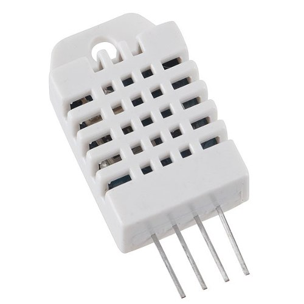
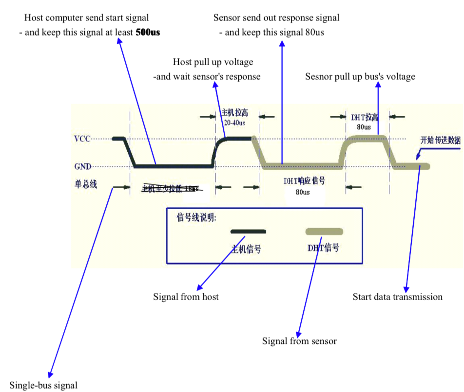
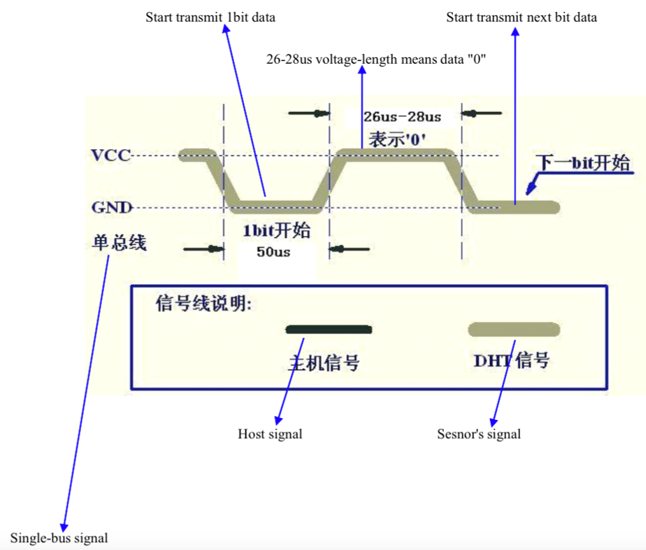
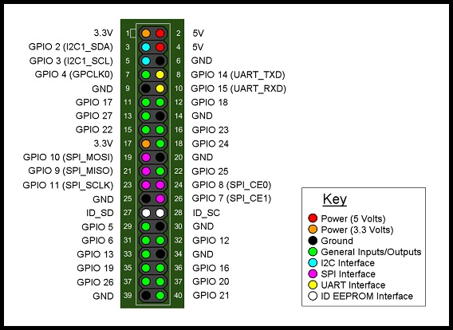
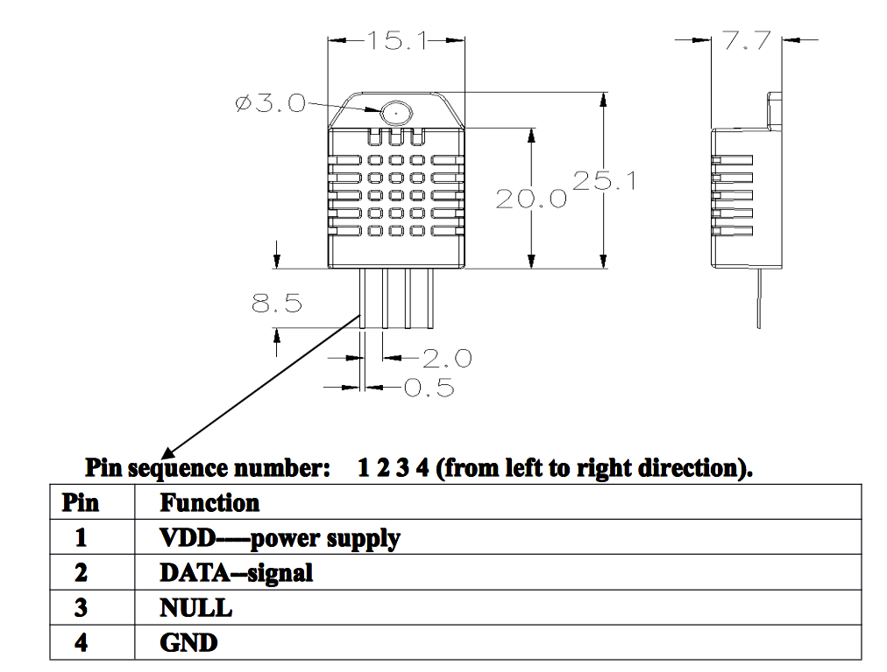
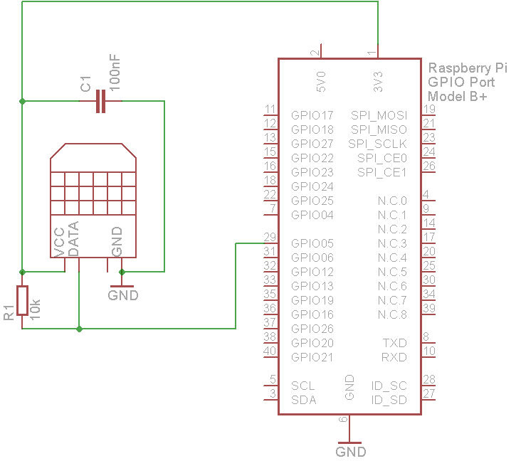
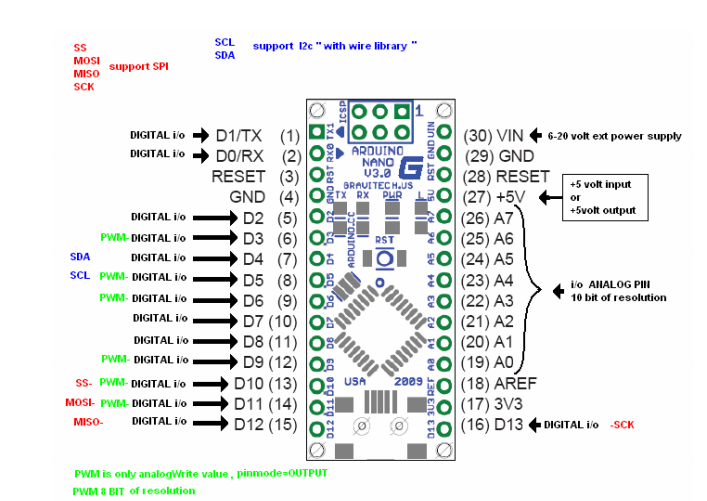
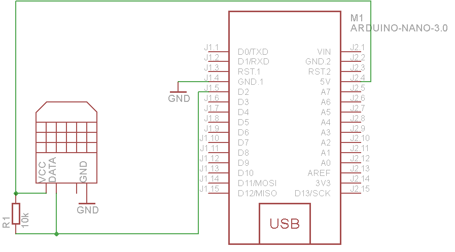

### Temperature and humidity sensor (DHT22, AM2303)

The DHT22 is a basic, low-cost digital temperature and humidity sensor. It uses a capacitive humidity sensor and a thermistor to measure the surrounding air, and spits out a digital signal on the data pin (no analog input pins needed). Its fairly simple to use, but requires careful timing to grab data. The only real downside of this sensor is you can only get new data from it once every 2 seconds, so when using our library, sensor readings can be up to 2 seconds old.



#### Features

* 3 to 5V power and I/O
* 2.5mA max current use during conversion (while requesting data)
* Good for 0-100% humidity readings with 2-5% accuracy
* Good for -40 to 80°C temperature readings ±0.5°C accuracy
* No more than 0.5 Hz sampling rate (once every 2 seconds)

#### Description

AM2303 output calibrated digital signal. It utilizes exclusive digital-signal-collecting-technique and humidity sensing technology, assuring its reliability and stability.Its sensing elements is connected with 8-bit single-chip computer.
Every sensor of this model is temperature compensated and calibrated in accurate calibration chamber and the calibration-coefficient is saved in type of programme in OTP memory, when the sensor is detecting, it will cite coefficient from memory.

**After powering**

When power is supplied to sensor, don't send any instruction to the sensor within one second to pass unstable status.

**Communication**

Data is comprised of integral and decimal part, the following is the formula for data. AM2303 send out higher data bit firstly!
* DATA=8bit integral RH data+8 bit decimal RH data+8 bit integral T data+8 bit decimal T data+8 bit check- sum
* If the data transmission is right, check-sum should be the last 8 bit of "8 bit integral RH data+8 bit decimal RH data+8 bit integral T data+8 bit decimal T data".

* Step 1: MCU send out start signal to AM2303
Data-bus's free status is high voltage level. When communication between MCU and AM2303 begin, program of MCU will transform data-bus's voltage level from high to low level and this process must beyond at least 18ms to ensure AM2303 could detect MCU's signal, then MCU will wait 20-40us for AM2303's response.



* Step 2: AM2303 send response signal to MCU
When AM2303 detect the start signal, AM2303 will send out low-voltage-level signal and this signal last 80us as response signal, then program of AM2303 transform data-bus's voltage level from low to high level and last 80us for AM2303's preparation to send data.



### Raspberry PI usage:

#### Pinout





#### Wiring



### Arduino nano usage:

#### Pinout



#### Wiring



#### First step
Download [DHT](https://github.com/adafruit/DHT-sensor-library/archive/master.zip) header library, and paste to your /Documents/Arduino/libraries/ lib.

#### Example code
```
#include "DHT.h"

#define DHTPIN 2     // what pin we're connected to
#define DHTTYPE DHT22   // DHT 22  (AM2302)
#define fan 4

int maxHum = 60;
int maxTemp = 40;

DHT dht(DHTPIN, DHTTYPE);

void setup() {
  pinMode(fan, OUTPUT);
  Serial.begin(9600);
  dht.begin();
}

void loop() {
  // Wait a few seconds between measurements.
  delay(2000);

  // Reading temperature or humidity takes about 250 milliseconds!
  // Sensor readings may also be up to 2 seconds 'old' (its a very slow sensor)
  float h = dht.readHumidity();
  // Read temperature as Celsius
  float t = dht.readTemperature();

  // Check if any reads failed and exit early (to try again).
  if (isnan(h) || isnan(t)) {
    Serial.println("Failed to read from DHT sensor!");
    return;
  }

  if(h > maxHum || t > maxTemp) {
      digitalWrite(fan, HIGH);
  } else {
     digitalWrite(fan, LOW);
  }

  Serial.print("Humidity: ");
  Serial.print(h);
  Serial.print(" %\t");
  Serial.print("Temperature: ");
  Serial.print(t);
  Serial.println(" *C ");

}
```

###### Source: adafruit.com
